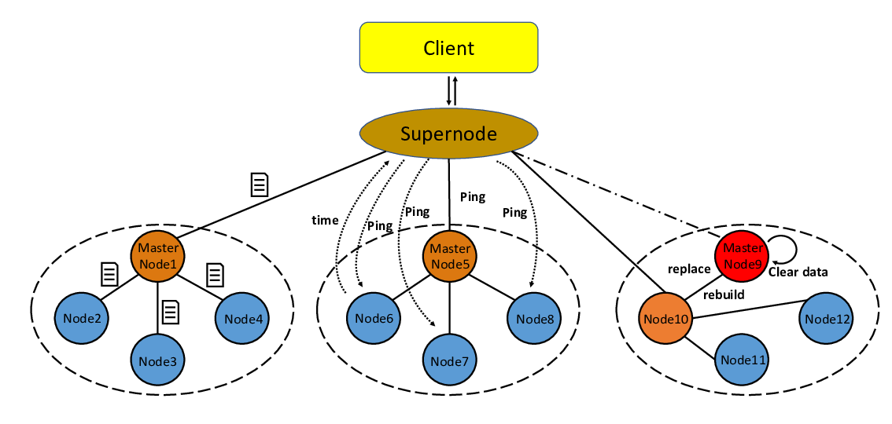

# Simple-Distributed-Storage-System
 
 CE7490 2021 Fall - Advanced Topics in Distributed System - Project 2: RAID-6 based distributed storage system


# Overview
RAID 6, also regarded as the double-parity RAID, is a RAID schemes that work by placing data on multiple disks and allowing input/output (I/O) operations to overlap in a balanced way, improving performance and offers redundancy to allow for disk failures within the RAID set and prevent data lost. 

Raid6 is a great filesystem, we try to reimplement its userland tools quick and frienfly.


You can explore the bullit from either:
- Store and access abstract “data objects” across storage nodes using RAID-6 for fault-tolerance.
- Include mechanisms to determine failure of storage nodes.
- Carry out rebuild of lost redundancy at a replacement storage node.
- Accommodate real files of arbitrary size, taking into account issues like RAID mapping, etc.
- Support mutable files, taking into account update of the content, and consistency issues.
- Support larger set of configurations
- Read or write bigsize fileo bject by chunk mode
- Recover <=2 disks
- Detect 1 corrupted disk
- Find which disk is corrupted
- Mutable files
- Concurrent actual read/write
- Optimized and raw gf8 multiplication
- Our support data types can be text-only or arbitrary bytes


Basically it turns this:


* We set up a super node to interact with client and manage different request from users. 
* We have three replica nodes for each master node, as shown in the orange node and blue nodes surrounded by the dashed circle in the Fig. For nodes other than super node, we employ Redundant Array of Independent Disks 6(RAID 6) to improve storage performance or reduce redundancy, or both. 
* Meanwhile, for the services of each node to be more efficient, super node maintain a node info.json to record each node as well as the resources it has to try to choose nodes with more resources to save files.


## Installation Guide
The RAID-6 system is devloped in Python environment with corresponding dependencies.

The project is supported on Linux or MacOS. 

### Installing Anaconda
Anaconda is a library that includes Python and many useful packages, as well as an environment manager called conda that makes package management simple.

Follow the [official instrutions](https://www.anaconda.com/distribution/) of Anaconda to install. Once it has been successfully installed, run the following command at terminal:

```
git clone https://github.com/ParsifalXu/Simple-Distributed-Storage-System.git
conda env create -f environment.yml
```

To use Python from the environment you just created, activate the environment with

```
conda activate RAID6
```

### or Install from pip

```
pip install -r requirements
```


# Usage

## Init 

Get into ./Nodes/node_1. node_2, node_3, node_4... as the same (you can only open 1 to 4 for test)
   
```
  cd  ./Nodes/node_1

```

## Init the super node
```
Usage:   to start the super node_
  
   python ./superserver.py runserver
   -h, --help  
```


### Run it

Run the server with:

<div class="termy">

```console
$ python ./superserver.py runserver

INFO:     Uvicorn running on http://127.0.0.1:5000 (Press CTRL+C to quit)
INFO:     Started reloader process [28720]
INFO:     Started server process [28722]
INFO:     Waiting for application startup.
INFO:     Application startup complete.
```

</div>

<details markdown="1">
<summary>About the command <code>superserver.py runserver</code>...</summary>

The command `python superserver.py` refers to:

* `main`: the file `main.py` (the Python "module").
* `app`: the object created inside of `main.py` with the line `app = Flask()`.
* `--reload`: make the server restart after code changes. Only do this for development. depend on you webserve. [Optional]


</details>


<details markdown="1">
<summary>About the command upload files...</summary>

The command `python superserver.py` refers to:
upload files
* `task_id`: the obtain unique id.
* `chunk`: obatin chunk order `int of Flask`.
    filename = '%s%s' % (task, chunk)  # struct unique chunk
* `filename`: make the server know hot to save it, always a unique chunk
*  "save into ./upload/{filename}  
*  "render index.html"

</details>


<details markdown="1">
<summary>About the command merge files...</summary>

The command `/file/merge` refers to:
read chunk content and write into new file, 
* `filename`: make the server know hot to save it, always a unique chunk
* `task_id`: the obtain unique id.
*  "save into ./upload/{filename}  
*  "render index.html"

</details>


<details markdown="1">
<summary>About the command List files...</summary>

The command `/file/list` refers to:
read chunk.json content and return the filelist, 
* `chunk.json`: should contain file_list
   * `file_list`: the specifical field of chunk.json, contain the filelist of it .
*  "render list.html"

</details>


<details markdown="1">
<summary>About the command download files...</summary>

The command `/file/download/{filename}` refers to:
read http://127.0.0.1:5001/download/{filename} content and render to browser, 
* `filename`: the specifical path to node download it .
*  "render application/octet-stream"

</details>


<details markdown="1">
<summary>About the command delete files...</summary>

The command `/file/delete/{filename}` refers to:
read http://127.0.0.1:5001/delete/{filename} content and render to browser, 
* `filename`: the specifical path to node download it .
*  "render 0 delete sucess and 1 for error occur"

</details>


<details markdown="1">
<summary>Receive files from nodes...</summary>

The command `/file/receive/` refers to:
read http://127.0.0.1:5001/receive/ content and render to browser, 
* `file_content`: the bianry byte encoder from javascript encode it to form-data  .
* `filename`: keep filename into node system as original
*  "render 0 upload sucess and 1 for error occur"

</details>


<details markdown="1">
<summary>ping each nodes...</summary>

The command `/file/receive/` refers to:
read http://127.0.0.1:500{i}/ping/ content and render to browser, 
* `i`: the bianry byte encoder from javascript encode it to form-data  .
* `error_times`: global variables   the times of error happened
*  " change status. 1 represents activate; 0 represents inactivate
  find this i belongs to which master node
  will not influence current service, do alarm
 "
</details>


<details markdown="1">
<summary>whether the node is master node...</summary>
* `master_node`:  field of node_info.json .
*  "render 0 upload sucess and 1 for error occur"

</details>


<details markdown="1">
<summary>whether the node is master node...</summary>
* `master_node`:  field of node_info.json .
*  "render 0 upload sucess and 1 for error occur"

</details>


## Storage

Store and access abstract “data objects” across storage nodes using RAID-6 for fault-tolerance
```
Usage:  Get into ./Nodes/node_1. node_2, node_3, node_4... as the same (you can only open 1 to 4 for test)
    
open  'http://127.0.0.1:500%s/save' %node

If [node] is specified, save information into node_i filesystems.

node_info.json
  -h, --help                 display this message
  -d, --debug                enable debug output
  -node_info.json            quota of backup_node  & quota the save node 

```

# Other Features 

- Mechanisms to determine failure of storage nodes
- Rebuild of the lost redundancy at a replacement storage node
- RAID-6 data recovery
- Analysis, synchronization mechanism and 
- Disaster tolerance and recovery
- RAID-6 Data Recovery Analysis


# RAID 6 Parity
-------------

RAID 6 uses 2 parity techniques to allow for up to 2 disks to become
unreadable, an xor-based technique, and a Reed-Solomon-based one (which is
based on Galois Fields).  As a way to explore these I built this simple
program based on a PDF from Kernel.org:
https://www.kernel.org/pub/linux/kernel/people/hpa/raid6.pdf

